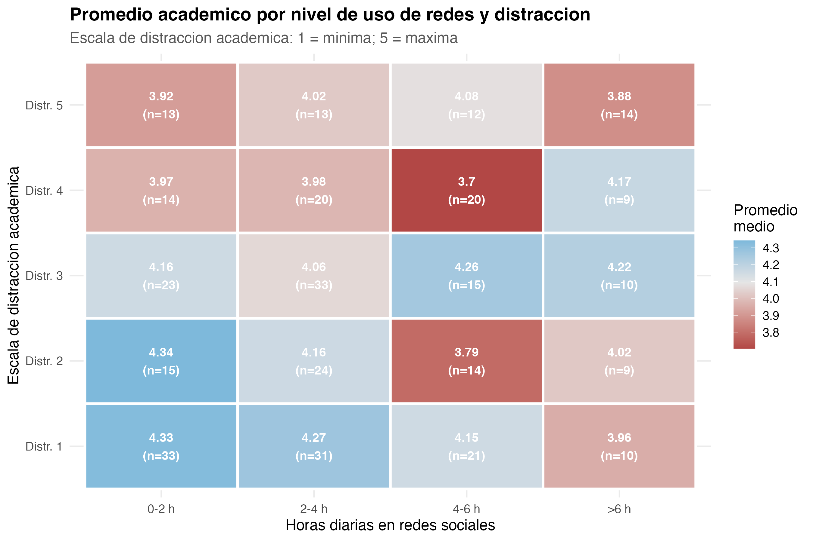

# Ficha 10

## Distracción académica vs promedio

### Nivel descriptivo: qué encontramos

**Titular:** La distracción sí importa.

**Nombre del hallazgo/resultado:** Asociación entre distracción académica y promedio académico.

**Resumen en una oración:** Mayor distracción académica se relaciona con menor promedio académico.

**Método o análisis que lo produjo:** Correlación y modelo de regresión.

**Evidencia:** Figura 7 y coeficiente negativo de `distraccion_acad` en el modelo seleccionado.

### Nivel analítico: qué significa

**Conexión con la pregunta de investigación:** Esta ficha es una de las más importantes, porque muestra que no solo importa cuánto tiempo se usan las redes sociales, sino también si ese uso interrumpe el estudio. Esto permite entender mejor la relación entre redes y rendimiento.

**Contraste con la literatura:** Esta ficha coincide con autores que señalan que el uso de redes puede afectar la concentración. También ayuda a explicar por qué algunos estudios no encuentran una relación directa entre tiempo en redes y rendimiento.

**Lo que NO explica este resultado:** No demuestra que la distracción sea causada únicamente por redes sociales. La distracción también puede venir de otros factores personales, familiares o académicos.

**Implicación para el siguiente paso:** La distracción académica se mantuvo como variable principal dentro del modelo final.
