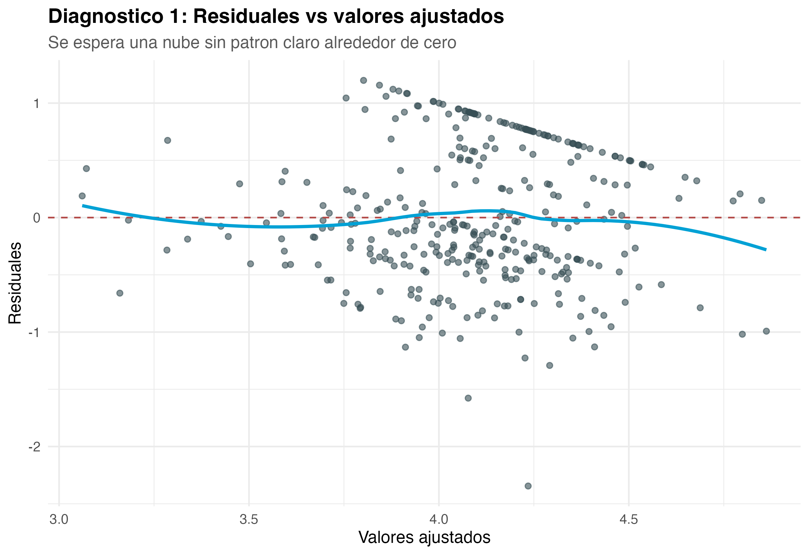
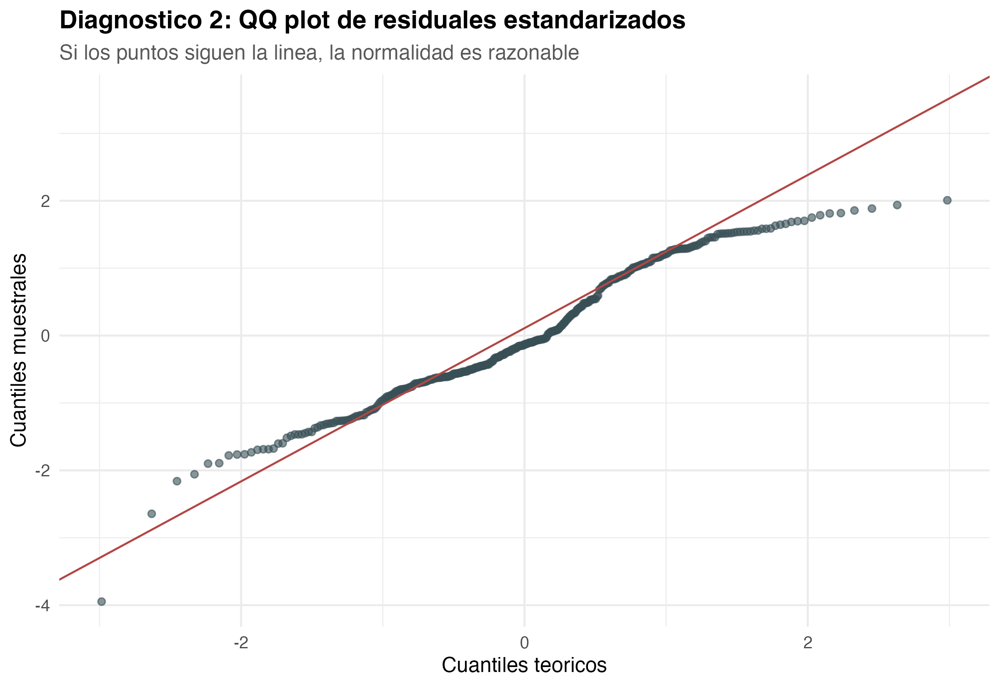

# Ficha 11

## Diagnóstico del modelo

### Nivel descriptivo: qué encontramos

**Titular:** El modelo requiere cautela.

**Nombre del hallazgo/resultado:** Revisión gráfica de los supuestos y valores influyentes del modelo.

**Resumen en una oración:** Los diagnósticos permiten interpretar el modelo con precaución razonable.

**Método o análisis que lo produjo:** Gráficos de residuos, QQ plot, histograma de residuos y distancia de Cook.

**Evidencia:** Figuras 8.1 y 8.2.

### Nivel analítico: qué significa

**Conexión con la pregunta de investigación:** El diagnóstico no responde directamente si existe relación entre redes sociales y rendimiento, pero permite saber si el modelo usado para responder la pregunta puede interpretarse de forma razonable.

**Contraste con la literatura:** Esta ficha no se contrasta directamente con literatura teórica, porque corresponde a la validación estadística del modelo.

**Lo que NO explica este resultado:** No explica el comportamiento académico de los estudiantes. Solo revisa si el modelo presenta problemas importantes.

**Implicación para el siguiente paso:** Los resultados del modelo deben presentarse como asociaciones estadísticas y no como conclusiones causales definitivas.