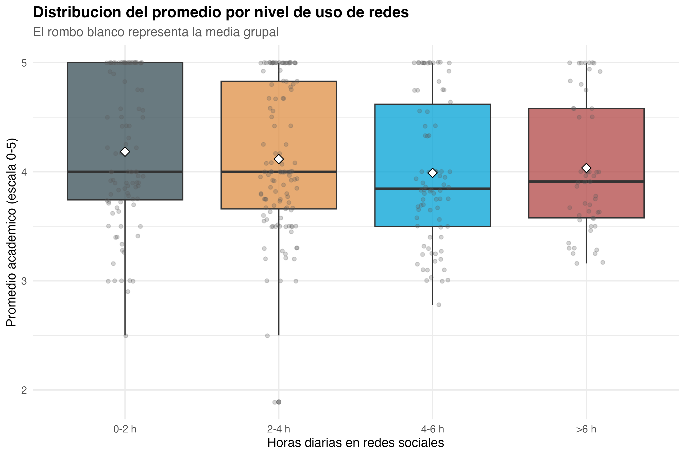

```markdown
# Ficha 5

## ANOVA: comparación entre cuatro categorías

### Nivel descriptivo: qué encontramos

**Titular:** Los grupos no son iguales.

**Nombre del hallazgo/resultado:** Comparación del promedio académico entre cuatro categorías de uso de redes sociales.

**Resumen en una oración:** El promedio cambia entre categorías, pero con diferencias moderadas.

**Método o análisis que lo produjo:** ANOVA de una vía.

**Evidencia:** Archivo `10_anova_cat_horas_redes.csv` y Figura 2.



### Nivel analítico: qué significa

**Conexión con la pregunta de investigación:** El ANOVA permite evaluar si existen diferencias en el rendimiento académico según el nivel de uso diario de redes sociales. Este análisis es útil porque no reduce el uso de redes a solo dos grupos, sino que permite comparar varios niveles.

**Contraste con la literatura:** Este resultado se relaciona con la literatura que muestra resultados mixtos. Las diferencias existen, pero no parecen lo suficientemente grandes como para afirmar que el tiempo en redes explique por sí solo el rendimiento académico.

**Lo que NO explica este resultado:** No indica qué grupo específico causa la diferencia ni explica por qué algunos estudiantes con alto uso mantienen buenos promedios.

**Implicación para el siguiente paso:** Se necesitó aplicar una prueba no paramétrica como Kruskal-Wallis y luego un modelo con más variables.
```
