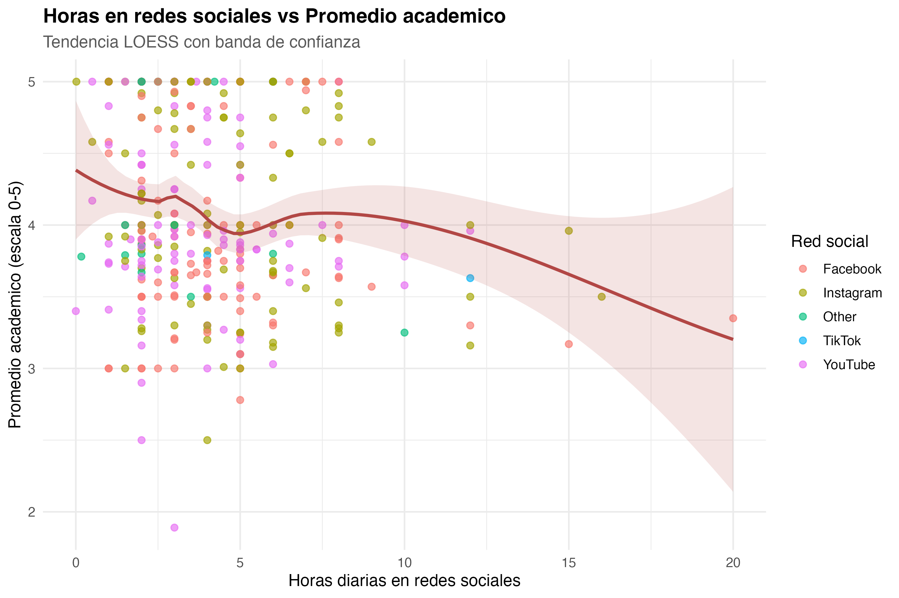

# Ficha 7

## Pearson: horas en redes vs promedio

### Nivel descriptivo: qué encontramos

**Titular:** Más redes, menor promedio.

**Nombre del hallazgo/resultado:** Asociación lineal entre horas diarias en redes sociales y promedio académico.

**Resumen en una oración:** Las horas en redes se asocian negativamente con el promedio académico.

**Método o análisis que lo produjo:** Correlación de Pearson.

**Evidencia:** Archivo `08_correlaciones_horas_redes_promedio.csv` y Figura 4.

### Nivel analítico: qué significa

**Conexión con la pregunta de investigación:** Esta ficha conecta directamente con la pregunta principal, porque analiza si el tiempo en redes sociales se relaciona con el rendimiento académico. La tendencia observada es negativa, aunque no totalmente fuerte.

**Contraste con la literatura:** Esta ficha coincide parcialmente con autores que señalan que el uso elevado de redes puede afectar el rendimiento. Sin embargo, también coincide con estudios de resultados mixtos, porque la relación no es perfecta ni explica todos los casos.

**Lo que NO explica este resultado:** No explica el tipo de uso de redes sociales ni si el estudiante usa esas plataformas para estudiar, entretenerse o comunicarse.

**Implicación para el siguiente paso:** Fue necesario incluir variables como distracción académica, horas de estudio y asistencia.
