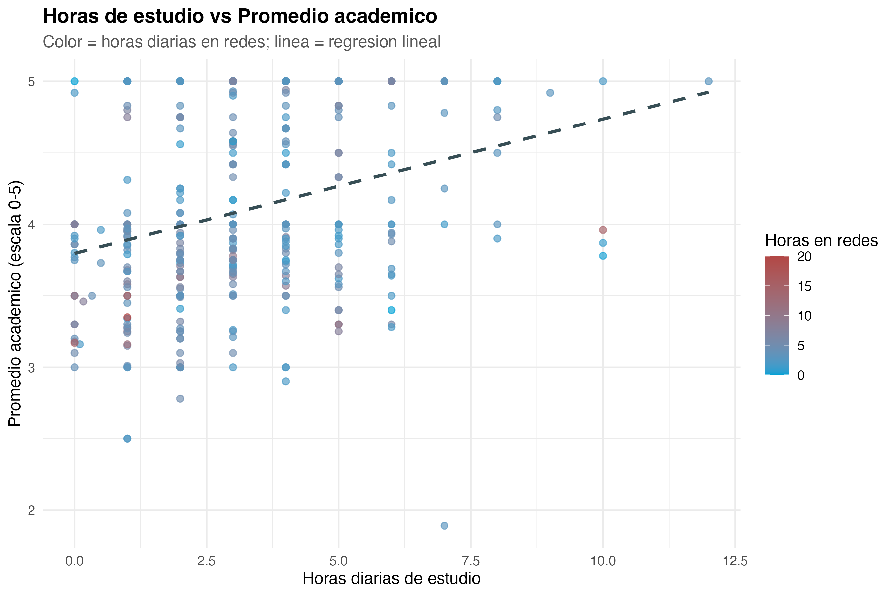

# Ficha 9

## Pearson: horas de estudio vs promedio

### Nivel descriptivo: qué encontramos

**Titular:** Estudiar más ayuda al promedio.

**Nombre del hallazgo/resultado:** Asociación entre horas de estudio y promedio académico.

**Resumen en una oración:** Más horas de estudio se asocian con mejores promedios académicos.

**Método o análisis que lo produjo:** Correlación de Pearson y modelo de regresión.

**Evidencia:** Figura 6 y coeficiente positivo de `horas_estudio` en el modelo seleccionado.

### Nivel analítico: qué significa

**Conexión con la pregunta de investigación:** Este resultado muestra que el rendimiento académico no debe explicarse únicamente por el uso de redes sociales. Las horas de estudio también tienen un papel importante en el promedio.

**Contraste con la literatura:** Este resultado coincide con la idea general de que el rendimiento académico es multifactorial. No contradice la literatura sobre redes sociales, sino que ayuda a explicar por qué el tiempo en redes no es suficiente para entender el rendimiento.

**Lo que NO explica este resultado:** No mide la calidad del estudio. Un estudiante puede estudiar muchas horas, pero con baja concentración o poca organización.

**Implicación para el siguiente paso:** Se incorporó esta variable dentro del modelo seleccionado para controlar parcialmente los hábitos académicos.
